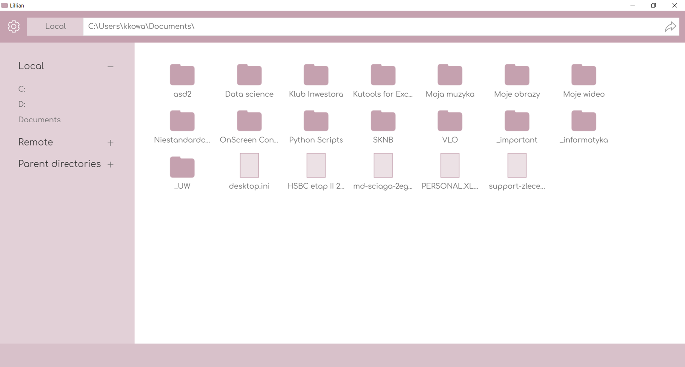

# lillian-file-manager  
A file manager created in electron.js, assignment for software engneering course at MIM UW, spring semester 2017-18.  
https://github.com/kowaalczyk/lillian-file-manager/  

To learn more about our project, see `PRESENTATION.pdf`.  

## Screenshots



## Features  

Implemented:  
* view folder content  
* change folder by providing path, selecting subfolder or selecting folder from left menu  

Future:  
* connect to remote drives (https)  
* create and manage favourite folder shortcuts  
* connect to cloud drives (Google Drive, OneDrive, etc.)  
* connect to remote locations via SSH  

## Dev setup  

### Installation  
Install all project dependencies  
```shell
npm install  
```

### Running project  
Assuming you have node.js, npm and electron.js installed, in project folder execute:  
```shell
npm run main
```
to open application.  

### Deployment  
#### Windows  
Deploy electron application to build folder  
```shell
npm run deploy-win32  
```  
Package application for shipping  
```shell
npm run zip-win32  
```  
#### Linux  
Deploy electron application to build folder  
```shell
npm run deploy-linux  
```  
Package application for shipping  
```shell
npm run zip-linux  
```  

## Communication between main and renderer
After opening window main sends message 'leftPanel' to renderer containing all info from .userData file.
If application is run with an argument main sends message same to reply to localRequest/remoteRequest.

Renderer requests for local directory content using message 'localRequest'. This message is alsolute path to directory. Example of the body of message:
```javascript
"/home/kris/Desktop/"
```

Renderer requests for remote directory content using message 'remoteRequest'. This message is a JSON object. It contains alias of remote drive and relative path. Example of the body of message:
```javascript
{
  "id" : "6c84fb90-12c4-11e1-840d-7b25c5ee775a",
  "alias" : "Main",
  "path" : "myFile/"
}
```

Renderer requests for new window using message 'newWindowRequest'. This message has empty body.

Renderer requests for adding new location using message 'addDisc'. This message has type of new location (local or remote), and all appropriate data regardind new location. Example for local: 
```javascript
{
  "type" : "local",
  "locationData" :
  {
    "alias" : "Docs",
    "path" : "/home/kris/Documents/"
   }
}
```

Example for remote:
```javascript
{
  "type" : "remote",
  "locationData" :
  {
    "alias" : "Main_server",
    "path" : "favourite",
    "url" : "http://5.135.159.114/io/",
    "login" : "asd",
    "pass" : "asd"
   }
}
```

Renderer requests for updating location using message 'updateDisc'. This message has old alias (before update), and all appropriate data regardind new location. Example for local: 
```javascript
{
  "oldAlias" : "Docs",
  "locationData" :
  {
    "alias" : "Docs",
    "path" : "/home/kris/Documents/myDocuments"
   }
}
```

Renderer requests for deleting location using message 'deleteDisc'. This message has alias of location to delete. Example of message body:
```javascript
"Docs"
```

Main responds to request message 'userConfig' with message with the same name containing whole userData.

Main sends message 'endOfStream' when whole stream was successfully parsed.

Main responds to requests for adding, updating and deleting using message 'actionResult'. This message contains bool variabe informing if requested action was performed and message about action. Example:
```javascript
{
  "valid" : "false",
  "message" : "This name already exists."
}
```

Main responds to remoteRequest and localRequest with message 'response'. This message contains file names, directory names, bool variabe informing if request was valid, path to requested directories, divided path to parent directories, absolute paths to parent directories, isLocal and alias. Example:
```javascript
{
  "isLocal" : "true",
  "alias" : ""
  "dividedPath" : [ '/' ],
  "parentPaths" : [ '/' ],
  "path" : "/home/",
  "filesNames" : [],
  "dirsNames" : [ 'kris' ],
  "valid" : "true"
}

```

When options window is closed main sends message 'updateUserData' which contains whole userData after all changes.
